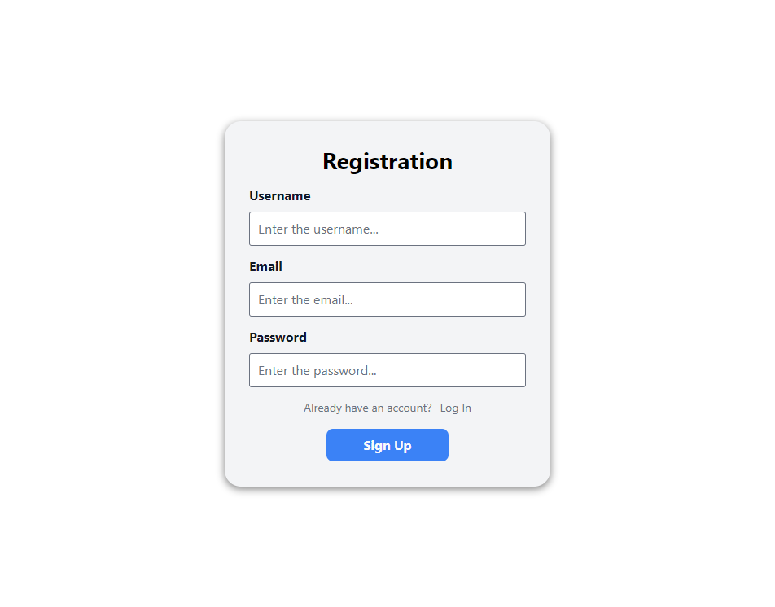

# ProjectifyWeb

## Description
Develop a fully functional web application for project management, enabling users to create, edit, and delete projects along with tasks within these projects. The application includes both client-side and server-side components.

**Technology Stack:**
- Frontend: React.js, Tailwind CSS
- Backend: Nest.js/Express, MongoDB
- Authentication: JWT
- Documentation: Swagger

## Screenshots of the results

<div style="display: flex; justify-content: space-between; gap: 10px">
    
    
    
    
    
</div>


## Basic Level:

**Client-Side:**
- Create a main page displaying a list of projects with sorting and search capabilities.
- Implement the ability to add a new project with form validation.
- Ensure responsive design using Tailwind CSS.  

**Server-Side:**
- Set up Nest.js/Express.js server and connect to MongoDB.
- Implement CRUD operations for the Project model.

## Intermediate Level:

_Prerequisite: Completion of the Basic Level_

**Client-Side:** 
- Add the ability to view project details and a list of tasks within each project.
- Implement the ability to add, edit, and delete tasks.
- Add notifications for the user upon successful or unsuccessful operation.  
   
**Server-side:**
- Develop the Task model and implement CRUD operations.
- Add authentication and authorization using JWT.
- Add a middleware for error handling and logging.

## Advanced level:

_Prerequisite: Completion of the Intermediate Level_

**Client-side:**
- Implement the ability to upload, view, and delete images for projects and tasks.
- Integrate pagination and filtering for lists.
- Add animations for transitions between pages and state changes of components.

**Server-side:**
- Implement file system operations for image uploading and deletion.
- Document the API using Swagger, including request and response models.
- Optimize database queries to improve overall performance and speed.

# Backend (server-side)

```bash
$ cd backend
```

## Description

To view API documentation on Swagger at [https://api-projectifyweb.up.railway.app/api](https://api-projectifyweb.up.railway.app/api)

[Nest](https://github.com/nestjs/nest) framework TypeScript starter repository.  
[Nest Documentation](https://docs.nestjs.com/)

## Installation

```bash
$ npm install
```

## Before Running the Server (dotenv)

1. Copy the `.env-example` file in directory `backend` and rename it to `.env`.

2. Modify the configurations in the `.env` file to suit your environment settings. Ensure the server connects to the database and other necessary configurations.

    Example `.env` file:
    ```dotenv
    # The secret key for JWT authentication (Required Field)
    JWT_SECRET=DO NOT USE THIS VALUE. INSTEAD, CREATE A COMPLEX SECRET AND KEEP IT SAFE OUTSIDE OF THE SOURCE CODE.

    # Token expiration time in seconds (e.g., 3600 for 1 hour)
    JWT_EXPIRES_IN=3600
    
    # The port on which the server is running
    PORT=4000

    # your connection string to MongoDB
    MONGO_LINK=`mongodb+srv://<username>:<password>@<cluster-domain>/?dbName=<database-name>&retryWrites=true&w=majority`

    # The URL of the frontend application
    FRONTEND_URL=http://localhost:3000

    # The root directory for storing files
    STORAGE_ROOT=./storage/

    # The maximum allowed image size for storage (in megabytes)
    STORAGE_MAX_IMAGE_SIZE=5

    # The allowed file extensions for cover images (comma-separated)
    ALLOWED_EXTENSIONS_COVER_IMAGES=jpg,jpeg,png,gif,bmp,svg,webp
    ```

3. Save the changes made in the `.env` file.

## Running the server app

```bash
# development
$ npm run start

# watch mode
$ npm run start:dev

# production mode
$ npm run start:prod
```
Runs the api server mode.\
Open [http://localhost:4000](http://localhost:4000).

To view the API documentation on Swagger, go to the path [http://localhost:4000/api](http://localhost:4000/api) or the API code json in the OpenAPI 3.0.0 configuration [http://localhost:4000/api-json](http://localhost:4000/api-json)  

<!-- ## Test

```bash
# unit tests
$ npm run test

# e2e tests
$ npm run test:e2e

# test coverage
$ npm run test:cov
``` -->

# Frontend (client-side)

```bash
$ cd frontend
```

## Installation

```bash
$ npm install
```

## Before Running the client-side app (dotenv)

1. Copy the `.env-example` file in directory `frontend` and rename it to `.env`.

2. Modify the configurations in the `.env` file to suit your environment settings. Ensure the server connects to the database and other necessary configurations.

    Example `.env` file:
    ```dotenv
    # The api server url
    REACT_APP_API_URL=http://localhost:4000
    ```

3. Save the changes made in the `.env` file.

## Running the client-side app

```bash
# development
$ npm run start

# production build
$ npm run build
```

Runs the app in the development mode.\
Open [http://localhost:3000](http://localhost:3000) to view it in your browser.
